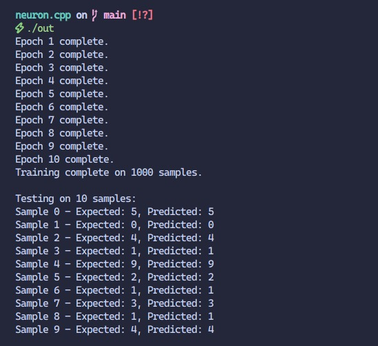

# a neural network implementation in c++

a 3-layer feed forward neural network using the MNIST dataset to test the implementation.

---

> ⚠️ Just a toy project – not suitable for real-world use cases as the NN is fully stack-based and heavily templated.

- no external libraries used

## Sample Output



## How to build
```bash
g++ -std=c++20 main.cpp -o nn
./nn

